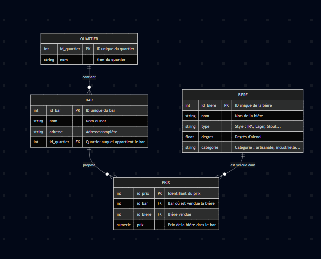
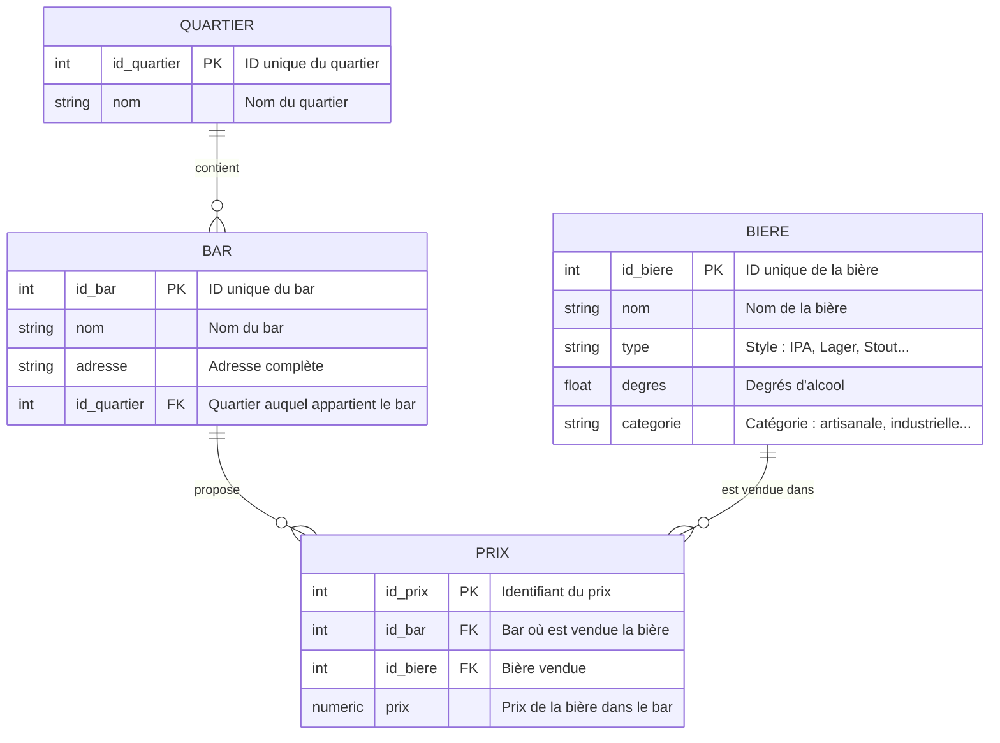

# TP Darill PostgreSQL - Module SQL

## Pré-requis

### 1. Terminal

Assurez-vous d'avoir accès à un terminal :
- **macOS** : Terminal (pré-installé) ou iTerm2
- **Windows** : PowerShell, Git Bash, ou Windows Terminal
- **Linux** : Terminal de votre distribution

### 2. Git

Git doit être installé sur votre machine :

- **macOS** : 
  ```bash
  # Vérifier si Git est installé
  git --version
  
  # Si non installé, installer via Homebrew
  brew install git
  ```

- **Windows** : Téléchargez et installez [Git pour Windows](https://git-scm.com/download/win)

- **Linux** :
  ```bash
  # Debian/Ubuntu
  sudo apt-get install git
  
  # Fedora
  sudo dnf install git
  ```

Vérifiez l'installation :
```bash
git --version
```

### 3. Cloner ce repository

```bash
git clone git@github.com:lgauthier1/coda-module-sql.git
cd coda-module-sql
```

Si vous n'avez pas encore configuré le remote :
```bash
git remote add origin git@github.com:lgauthier1/coda-module-sql.git
```

### 4. Installer Docker

Assurez-vous d'avoir Docker installé sur votre machine :

- **macOS** : Téléchargez et installez [Docker Desktop pour Mac](https://www.docker.com/products/docker-desktop)
- **Windows** : Téléchargez et installez [Docker Desktop pour Windows](https://www.docker.com/products/docker-desktop)
- **Linux** : Suivez les instructions sur [docs.docker.com](https://docs.docker.com/engine/install/)

Vérifiez l'installation :
```bash
docker --version
docker-compose --version
```

### 5. Client PostgreSQL

**Option 1 : pgAdmin via Docker (recommandé)**

## Démarrage de la base de données

### Option 1 : PostgreSQL seul (recommandé si problème avec pgAdmin)

```bash
docker-compose up -d
```

### Initialiser le schéma et les données

Les scripts qui doivent être exécutés manuellement après le premier démarrage :

```bash
# 1. Créer le schéma et les tables
docker-compose exec -T postgres psql -U codaSchoolUser -d codaSchool < scripts/schema.sql

# Vérifier que les tables ont été créées
docker-compose exec postgres psql -U codaSchoolUser -d codaSchool -c "SELECT tablename FROM pg_tables WHERE schemaname = 'beerproject';"

# 2. Charger les données de test
docker-compose exec -T postgres psql -U codaSchoolUser -d codaSchool < scripts/seed.sql

# Vérifier que les données ont été insérées
docker-compose exec postgres psql -U codaSchoolUser -d codaSchool -c "SET search_path TO beerproject; SELECT COUNT(*) FROM quartier; SELECT COUNT(*) FROM bar; SELECT COUNT(*) FROM biere; SELECT COUNT(*) FROM prix;"
```

La base de données sera accessible avec les paramètres suivants :
- **Host** : `localhost`
- **Port** : `5433`
- **Database** : `codaSchool`
- **Username** : `codaSchoolUser`
- **Password** : `verySecretAndSecurePassword`

### Vérifier que le conteneur fonctionne

```bash
docker-compose ps
```

### Arrêter la base de données

```bash
docker-compose down
```

### Arrêter et supprimer les données

```bash
docker-compose down -v
```


## 1. Présentation générale

Ce projet a pour objectif de concevoir une base de données relationnelle permettant de cartographier les bars de Dijon et d’analyser les prix des bières qu’ils proposent.
La base doit permettre :

* de localiser les bars par quartier ;
* de gérer un catalogue de bières ;
* de connaître les prix appliqués par chaque bar ;
* de réaliser des analyses (sur prix moyens, bars les moins chers, disponibilité…) ;

La modélisation repose sur quatre entités principales : **Quartier**, **Bar**, **Bière**, et **Prix**.

---

## 2. Entités principales & explications (attributs importants, choix des types de mes champs...)

### ### **2.1 QUARTIER**

Représente les différents quartiers de la ville de Dijon.

| Attribut      | PK/FK | Type    | Description                    |
| ------------- | ----- | ------- | ------------------------------ |
| `id_quartier` | PK    | int     | Identifiant unique du quartier |
| `nom`         |       | string  | Nom officiel du quartier       |

Un quartier sert à regrouper et géolocaliser les bars donc je retient juste le nom et ensuite un ID pour <br>
qu'il soit unique (vu que il peut y avoir des doublons même sur des nomss).

---

### **2.2 BAR**

Représente les bars qui vendent des bières.

| Attribut      | PK/FK | Type    | Description                          |
| ------------- | ----- | ------- | ------------------------------------ |
| `id_bar`      | PK    | int     | Identifiant unique du bar            |
| `nom`         |       | string  | Nom du bar                           |
| `adresse`     |       | string  | Adresse complète                     |
| `id_quartier` | FK    | int     | Référence au quartier d’implantation |


Ici j'enregistre quelques données essentielles du bar comme son adresse complète (string et ensuite VARCHAR dans
 la base), son nom et surtout l'id <br> du quartier auquel il appartient car sans çà on aurait du mal à 
 l'dentifier à un quartier précis de notre base.

---

### **2.3 BIERE**

Représente les bières disponibles dans les différents bars.

| Attribut    | PK/FK | Type    | Description                           |
| ----------- | ----- | ------- | ------------------------------------- |
| `id_biere`  | PK    | int     | Identifiant unique de la bière        |
| `nom`       |       | string  | Nom commercial                        |
| `type`      |       | string  | Style : IPA, Lager, Stout…            |
| `degres`    |       | float   | Taux d’alcool                         |
| `categorie` |       | string  | Catégorie : artisanale, industrielle… |

<br> le type en string puis le degres en float pour un minimum de précision. J'ai aussi choisi de mettre <br>
type et categorie car le type c'est plus le style de la bière, son processus de production, son goût alors que
<br> la catégorie c'est plus l'origine (artsanale ou industrielle...).

---

### **2.4 PRIX**

Entité reliant **BAR** et **BIERE**.

| Attribut   | PK/FK | Type    | Description               |
| ---------- | ----- | ------- | ------------------------- |
| `id_prix`  | PK    | int     | Identifiant du prix       |
| `id_bar`   | FK    | int     | Bar vendant la bière      |
| `id_biere` | FK    | int     | Référence de la bière     |
| `prix`     |       | numeric | Prix appliqué dans ce bar |

Un enregistrement de cette table correspond à **une bière vendue dans un bar à un prix donné** donc chaque ligne
<br> de PRIX dépend d'une et une seule des deux autres (règle à implémenter lors de le création de ma table). <br>
Ensuite il faut donc définir les clés venant de chacune de ces autres tables et pour finir mettre le prix <br>
à NUMERIC pour avoir beaucoup plus de précision et gérer facilement les arrondis.

---

## 3. Relations entre les entités

### **QUARTIER → BAR** (1,N)

Un quartier peut contenir plusieurs bars ( donc au minimum 1 pour être dans la base ) &  
Un bar appartient obligatoirement à un et seul quartier selon la config voulue pour ma base.

### **BAR ↔ BIERE à travers l'entité PRIX** (N,N)

Un bar peut proposer plusieurs bières &  
Une même bière peut être disponible dans plusieurs bars différents.  
Cette relation en N-N est implémentée par la table PRIX.

### **BAR → PRIX** (1,N)

Un bar possède autant de lignes qu’il propose de bières et donc un prix particulier est relié à 1 seul bar  
tandis que le bar propose quand même plusieurs prix.

### **BIERE → PRIX** (1,N)

Une meme bière peut apparaître dans plusieurs bars mais son prix reste relatif au bar courant.

---

## 4. Mes règles métier

1. **Chaque bar doit proposer au moins une bière.**

   * Un bar ne peut exister sans au moins un enregistrement dans la table `PRIX`.

2. **Un couple (bar, bière) est unique.**

   * Un bar ne peut pas avoir deux prix pour la même bière.

3. **Le prix d’une bière doit être strictement positif.**

4. **Un quartier doit contenir au minimum 1 bar dans les données fournies.**

5. **Les degrés d’alcool doivent être un nombre positif.**

---


## Voici mon schéma et la 'Synthaxe Mermaid pour le générer'



<br><br>


